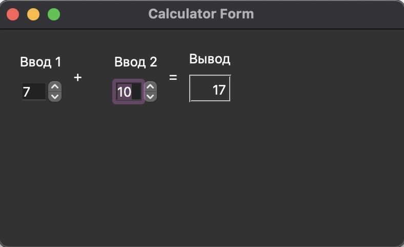

<p align="center">МИНИСТЕРСТВО НАУКИ  И ВЫСШЕГО ОБРАЗОВАНИЯ РОССИЙСКОЙ ФЕДЕРАЦИИ<br>
Федеральное государственное автономное образовательное учреждение высшего образования<br>
"КРЫМСКИЙ ФЕДЕРАЛЬНЫЙ УНИВЕРСИТЕТ им. В. И. ВЕРНАДСКОГО"<br>
ФИЗИКО-ТЕХНИЧЕСКИЙ ИНСТИТУТ<br>
Кафедра компьютерной инженерии и моделирования</p>
<br>
<h3 align="center">Отчёт по лабораторной работе 3 - Знакомство с фреймворком Qt<br> по дисциплине "Программирование"</h3>
<br><br>
<p>студента 1 курса группы ПИ-б-о-202(1)<br>
Окатьев Олег Анатольевич<br>
направления подготовки 09.03.04 "Программная инженерия"</p>
<br><br>
<table>
<tr><td>Научный руководитель<br> старший преподаватель кафедры<br> компьютерной инженерии и моделирования</td>
<td>(оценка)</td>
<td>Чабанов В.В.</td>
</tr>
</table>
<br><br>
<p align="center">Симферополь, 2021</p>
<hr>

## Цель:

 1. Установить фреймворк Qt;
2. Изучить основные возможности создания и отладки программ в IDE Qt Creator.
### Постановка задачи
Настроить рабочее окружение, для разработки программного обеспечения при помощи Qt и IDE Qt Creator, а также изучить базовые возможности данного фреймворка.

## Ход работы
### Задание 1
1. Скачайте с официального сайта и установите последнюю стабильную версию фреймворка Qt;
Внимание! Путь к не должен содержать русских символов, т.к. это может привести, в дальнейшем, к  ошибкам во время сборки.
2. В процессе установки выберите компоненты Qt для сборки при помощи MinGW и подходящую к этим компонентам версию MinGW.
3. Чтобы убедиться, что установка прошла успешно, запустите среду разработки Qt Creator и в разделе Примеры найдите проект Calculator Form Example.
4. Щёлкнув по проекту вам будет предложено изучить краткую документацию по нему, а так же выбрать и настроить комплект сборки. Выбирайте версию под Desktop, после чего щелкайте по кнопке Редактор.
5. На боковой панели в разделе Проекты в каталоге Формы откройте главную форму проекта и замените текст "Input 1", "Input 2", "Output" на "Ввод 1", "Ввод 2" и "Вывод" соответственно. Для этого нужно щёлкнуть по нужному компоненту на форме и в окне Редактор свойств поменять значение свойства text (используйте фильтр).
6. Скриншот приложения добавьте в отчёт.
### Задание 2
Добавьте в отчёт ответы на следующие вопросы. Текст вопросов продублируйте в отчёте:

1. Как изменить цветовую схему (оформление) среды?
2. Как закомментировать/раскомментировать блок кода средствами Qt Creator? Имеется ввиду комбинация клавиш или пункт меню.
3. Как открыть в проводнике Windows папку с проектом средствами Qt Creator?
4. Какое расширение файла-проекта используется Qt Creator? Может быть несколько ответов.
5. Как запустить код без отладки?
6. Как запустить код в режиме отладки?
7. Как установить/убрать точку останова (breakpoint)?
### Задание 3
1. Создайте консольное приложение без Qt.
Внимание! Путь к проекту не должен содержать русских символов, т.к. это может привести к ошибкам во время сборки.

2. Замените содержимое файла main.cpp на:
```C++
#include <iostream>
 
int main() {
    int i;
    double d;
    i = 5;
    d = 5;
    std::cout << i << d;
}
```
3. Переключите режим сборки в режим Отладка;

4. Установите точки останова на 6, 7, 8 строках;

5. Выполните программу в режиме отладки;

6. В отчёт добавьте ответы на вопросы:

    - Чему равны переменные i и d в 6 строке (тут и далее, нужно написать значения);
    - Чему равны переменные i и d в 7 строке;
    - Чему равны переменные i и d в 8 строке;
### Задание 4
Начиная работать с новым инструментом важно не забыть настроить git, а точнее файл .gitignore, чтобы в репозиторий не попадал всякий мусор.

1. Для Qt уже существуют шаблоны .gitignore-файлов например gitignore.io или на github.
2. Если у вас в репозитории уже есть .gitignore просто добавьте туда новые строки, если вы только создали репозиторий, то не забудьте и про остальные инструменты которыми пользуетесь.

## Выполнение работы

### Задание 1
Переходим на официальный сайт [фреймворка](https://qt.io). Скачиваем фреймворк и устанавливаем его. После установки открываем приложение и переходим в пункт меню "Начало", далее выбираем пункт "Примеры" и находим проект "Calculator Form Example", выбираем его и настраиваем. Пробуем собрать и запустить проект.
На боковой панели в разделе Проекты в каталоге Формы открываем главную форму проекта и заменяем текст “Input 1”, “Input 2”, “Output” на “Ввод 1”, “Ввод 2” и “Вывод”.
В результате получится такой графический интерфейс.


Рисунок 1 - Приложение

### Задание 2
1. Как изменить цветовую схему (оформление) среды?
    1. Инструмены >> Параметры >> Среда
    2. Во вкладке интерфейс выбрать цветовую схему.
2. Как закомментировать/раскомментировать блок кода средствами Qt Creator? Имеется ввиду комбинация клавиш или пункт меню.
    1. Комбинация Cntr + / (Cmd + /)
3. Как открыть в проводнике Windows папку с проектом средствами Qt Creator?
    1. Вызвать контекстное меню нужного файла.
    2. Выбрать пункт "Показать в проводнике".
4. Какое расширение файла-проекта используется Qt Creator? Может быть несколько ответов.
    .pro
5. Как запустить код без отладки?
    Кмбинация Cntr+R или нажать на кнопку "Запустить" в нижнем левом углу(Кнопка пуск).
6. Как запустить код в режиме отладки?
    1. Выбрать режим Отладки в левом нижнем углу.
    2. Нажать кнопку "Начать отладку запускающего проекта" в нижнем левом углу.(Кнопка пуск с жуком)
7. Как установить/убрать точку останова (breakpoint)?
    Точки останова устанавливаются/убираются кликом по нужной строке левее ее номера или в меню Отладка >> Поставить/снять точку останова, а также клавишей F9.

### Задание 3
В пункте меню "Файл", выбираем пункт "Создать файл или проект", далее выбираем "Проект без Qt" и создаем его.
Ставим точки остановки в файле main.cpp, далее запускаем проект в режиме отладки.
- Чему равны переменные i и d в 6 строке:
    - i = 1, d = 6.9531301384865e-310;
 - Чему равны переменные i и d в 7 строке:
    - i = 5, d = 6.9531301384865e-310;
- Чему равны переменные i и d в 8 строке;
    - i = 5, d = 5;

