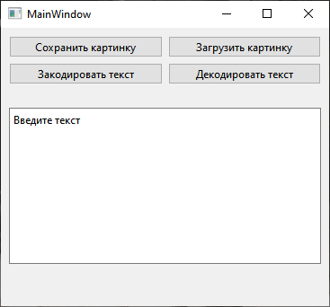

МИНИСТЕРСТВО НАУКИ  И ВЫСШЕГО ОБРАЗОВАНИЯ РОССИЙСКОЙ ФЕДЕРАЦИИ 
Федеральное государственное автономное образовательное учреждение высшего образования 
"КРЫМСКИЙ ФЕДЕРАЛЬНЫЙ УНИВЕРСИТЕТ им. В. И. ВЕРНАДСКОГО" 
ФИЗИКО-ТЕХНИЧЕСКИЙ ИНСТИТУТ 
Кафедра компьютерной инженерии и моделирования

 

<h3 align="center">Отчёт по лабораторной работе № 5  по дисциплине "Программирование"</h3>

 

 

студента 1 курса группы ПИ-б-о-202(1) 
Окатьев Олег Анатольевич 
направления подготовки 09.03.04 "Программная инженерия"

 

 

<table>
<tr><td>Научный руководитель  старший преподаватель кафедры  компьютерной инженерии и моделирования</td>
<td>(оценка)</td>
<td>Чабанов В.В.</td>
</tr>
</table>

 

 

Симферополь, 2021

## Постановка задачи

Создать десктоп приложение с GUI позволяющее сохранять текстовую информацию в изображение формата png без видимого изменения исходного изображения. Приложение должно позволять сохранять текст в картинку и извлекать текст из картинки.

## Цель работы

1. Изучить базовые встроенные элементы фреймворка Qt предназначенные для создания приложений с графическим интерфейсом пользователя (GUI);
2. Изучить сигнально-слотовую систему, как один из способов организации взаимодействия компонентов GUI;
3. Получить практический навык работы с побитовыми операторами.

## Выполнение работы

### Подготовка графического интерфейса.
С помощью дизайнера графического интерфейса Qt Designer был разработан графический интерфейс для работы с кодировкой и декодировкой текста в изображении. Созданы 4 кнопки, 2 виджета.

Рисунок 1 - Графический интерфейс программы
  
### Программа на С++.

Подключил файл с графическим интерфейсом к проекту и приступаю к написанию кода на языке `C++`. Первым делом привязываю кнопки к функциям, а уже далее - расписываю каждую функцию соответвенно её кнопке.
В декодированном сообщении содержится ссылка на на веб-страницу.
 

Рисунок 2 - Картинка с зашифрованным текстом

### Вывод

В ходе лабораторной работы я :
- изучил базовые встроенные элементы фреймворка Qt
- изучил сигнально-слотовую систему
- получил практические знания работы с побитовыми операторами
 
